<!-- ANIMATED HEADER — file: header.svg must be in root of this repo -->
<p align="center">
  
</p>

<!-- TYPING SVG -->
<p align="center">
  
</p>

<!-- JUMPING CATS -->
<p align="center">
  
  &nbsp;&nbsp;
  
  &nbsp;&nbsp;
  
</p>

<br/>

<!-- ABOUT ME -->


## 🧠 About Me

```python
class Kushal:
    pronouns   = "he / him"
    location   = "India 🇮🇳"
    focus      = ["Quantum ML", "Deep Learning",
                  "Computer Vision"]
    stack      = ["Python", "C++", "PyTorch", "Qiskit"]
    currently  = "Collapsing wavefunctions into models 🌊"
    fun_fact   = "I debug circuits AND neural nets ⚡"
    dm_open    = True  # always!
```

<br/>

📬 **Reach me at:** [kurkurekushalofficial@gmail.com](mailto:kurkurekushalofficial@gmail.com)

<br clear="right"/>

---

## 🌐 Socials

<p align="left">
  <a href="https://x.com/thequantbeing">
    
  </a>
  &nbsp;
  <a href="mailto:kurkurekushalofficial@gmail.com">
    
  </a>
  &nbsp;
  <a href="https://linkedin.com/in/kushalkurkure">
    
  </a>
</p>

---

## ⚡ Tech Stack

**Languages**


**Frameworks & Tools**


**ML / Data**


**Dev**


---

## 📊 GitHub Stats

<p align="center">
  
  &nbsp;
  
</p>

<p align="center">
  
</p>

---

## 🏆 Trophies

<p align="center">
  
</p>

---

<p align="center">
  
</p>

<p align="center">
  
</p>

<p align="center">
  
</p>
